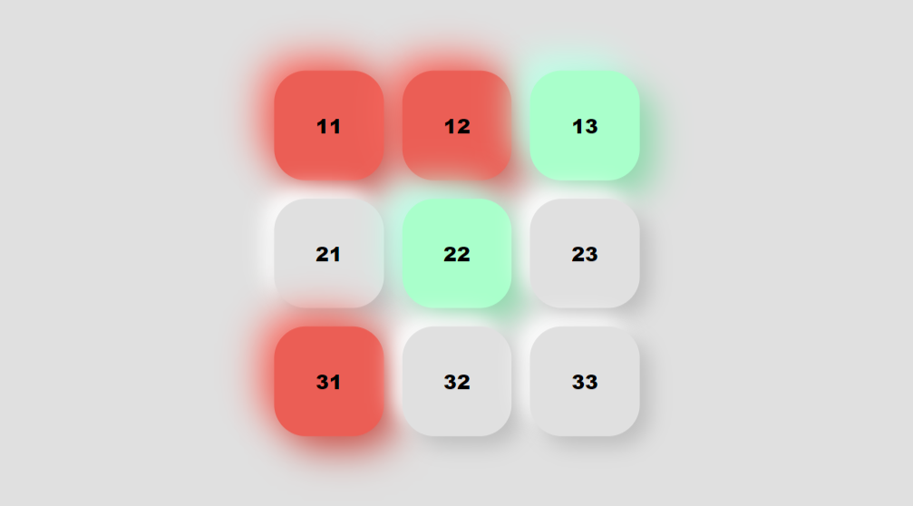
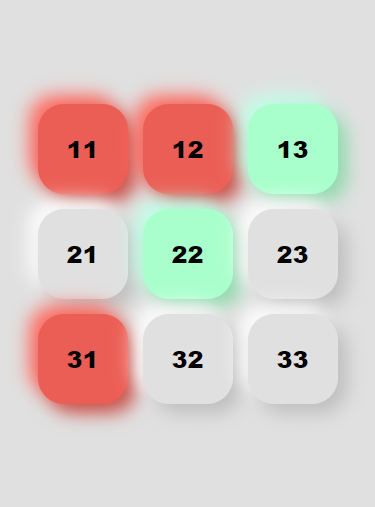

# TIC TAC TOE 🎮

This is a repository for my tic tac toe game.

## Table of contents

-   [Overview](#overview)
    -   [The challenge](#the-challenge)
    -   [Screenshot](#screenshot)
    -   [Links](#links)
-   [My process](#my-process)
    -   [Built with](#built-with)
    -   [Continued Development](#continued-development)
-   [Author](#author)

## Overview

### The challenge

Users should be able to:

-   View the optimal layout for the site depending on their device's screen size
-   Interact with the Board via clicking on the button
-   Change turns automatically one after another
-   Get results based on thier performance

### Screenshot

### Links

-   Live Site URL: [Tic Tac Toe](https://niraj-tic-tac-toe.netlify.app/)

## My process

### Built with

-   Semantic HTML5 markup
-   CSS custom properties
-   CSS Grid
-   Mobile-first workflow
-   Javascript

### Continued Development

-   Will add a replay button later.
-   Will transfer all of the functionality of my high school python project in this project, including but not limited to, a computer algorithm as an opponent, a profile feature, ranked games, etc.
-   Will definitely work on a 3D tic tac toe game sometime in the future.

## Author

<!-- -   Website - [Add your name here](https://www.your-site.com) -->

-   Linked In - [@niraj-kumar-r](https://www.linkedin.com/in/niraj-kumar-r/)
-   Frontend Mentor - [@niraj-kumar-r](https://www.frontendmentor.io/profile/niraj-kumar-r)
-   Twitter - [@niraj_kumar_r](https://www.twitter.com/niraj_kumar_r)
